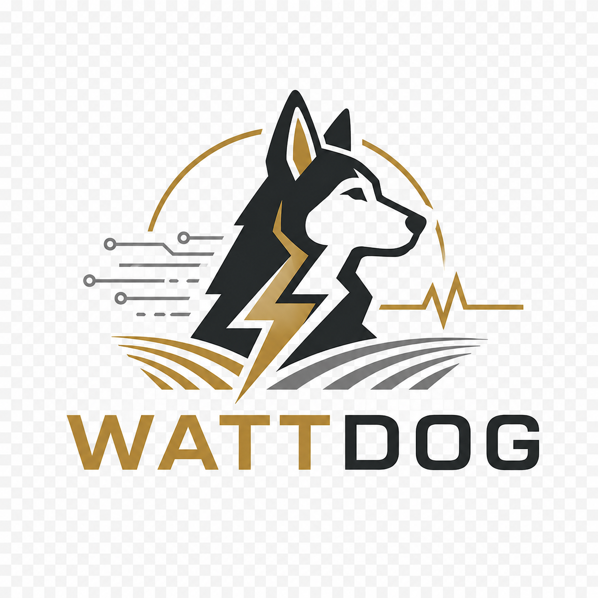

<picture>
  <source media="(prefers-color-scheme: dark)" srcset="assets/logo-dark.png">
  <source media="(prefers-color-scheme: light)" srcset="assets/logo.png">
  
</picture>

# wattdog

PowerMon watchdog daemon for PiKVM/Raspberry Pi systems.

The daemon scans Thornwave BLE advertisements through Thornwave's native SDK, serves `/healthz` and Prometheus-compatible `/metrics`, stores observed samples as local Parquet files, and uses configured thresholds to drive HTTP actions.

## Use Built Assets

GitHub Actions builds release binaries and container images. Prefer these unless you need to change the code or rebuild against a local Thornwave SDK checkout.

### Release Binary

Download the Raspberry Pi 64-bit tarball from the latest GitHub release:

```bash
curl -LO "$(curl -fsSL https://api.github.com/repos/oats-center/wattdog/releases/latest \
  | jq -r '.assets[] | select(.name | endswith("linux-arm64-rpi64.tar.gz")) | .browser_download_url')"
tar -xzf wattdog-*-linux-arm64-rpi64.tar.gz
install -m 0755 wattdog /usr/local/bin/wattdog
```

For x86_64 Linux, use `wattdog-*-linux-amd64.tar.gz` instead.

### Container Image

GitHub Actions also publishes images to GHCR:

```bash
podman pull ghcr.io/oats-center/wattdog:main
podman run --rm \
  --name wattdog \
  -p 127.0.0.1:9107:9107 \
  -v /run/dbus/system_bus_socket:/run/dbus/system_bus_socket:ro \
  -v /etc/wattdog/config.toml:/etc/wattdog/config.toml:ro \
  -v /var/lib/wattdog:/var/lib/wattdog:Z \
  ghcr.io/oats-center/wattdog:main
```

Use a release tag, such as `ghcr.io/oats-center/wattdog:v0.1.0`, when you want a pinned version.

### Quadlet

Install the Quadlet unit if you want systemd to manage the container:

```bash
install -d /etc/containers/systemd
curl -fsSL https://raw.githubusercontent.com/oats-center/wattdog/main/packaging/wattdog.container \
  -o /etc/containers/systemd/wattdog.container
sed -i 's#Image=localhost/wattdog:latest#Image=ghcr.io/oats-center/wattdog:main#' \
  /etc/containers/systemd/wattdog.container
systemctl daemon-reload
systemctl enable --now wattdog.service
```

Change `Image=` to a release tag, such as `ghcr.io/oats-center/wattdog:v0.1.0`, when you want a pinned version.

The container mounts `/run/dbus/system_bus_socket` because BlueZ exposes Bluetooth scanning over the host system bus.

Use LAN addresses, another container/pod address, or Podman's host gateway name in action URLs. For an action service running on the same host, use `http://host.containers.internal/...`. Switch to `--network host` only if the action service is bound to host loopback and cannot be changed.

## Custom Build

### Build Requirements

The Thornwave SDK is a mandatory build-time dependency, but it is not committed to this repository. Clone the public SDK repo into the ignored `vendor/libpowermon_bin` path:

```bash
mkdir -p vendor
git clone https://git.thornwave.com/git/thornwave/libpowermon_bin.git vendor/libpowermon_bin
```

By default, `build.rs` uses `vendor/libpowermon_bin` and selects the static library by target architecture:

- `powermon_lib_pic.a` for normal x86_64 Linux development builds
- `powermon_lib_rpi64_pic.a` for aarch64/Raspberry Pi 64-bit builds

Build with:

```bash
cargo build --release
```

To use a different local SDK checkout or library filename:

```bash
export THORNWAVE_SDK_DIR=/opt/libpowermon_bin
export THORNWAVE_LIB_FILE=powermon_lib_rpi64_pic.a
cargo build --release
```

`build.rs` requires:

- `$THORNWAVE_SDK_DIR/inc/powermon.h`
- `$THORNWAVE_SDK_DIR/inc/powermon_scanner.h`
- `$THORNWAVE_SDK_DIR/$THORNWAVE_LIB_FILE`

The build links the Thornwave static library plus `stdc++`, `bluetooth`, and `dbus-1`.

### Cross-compile for aarch64/Raspberry Pi 64-bit

The recommended cross-build path is [`cross`](https://github.com/cross-rs/cross). This crate includes `Cross.toml` and a Fedora 42 based `Dockerfile.aarch64-unknown-linux-gnu` for `aarch64-unknown-linux-gnu`.

```bash
cargo install cross --git https://github.com/cross-rs/cross
cross build --release --target aarch64-unknown-linux-gnu
```

The resulting binary is:

```text
target/aarch64-unknown-linux-gnu/release/wattdog
```

### Build Container Locally

Build the Raspberry Pi binary first, then build the Fedora 42 runtime image from that binary:

```bash
cross build --release --target aarch64-unknown-linux-gnu
podman build --arch arm64 -f packaging/Containerfile -t localhost/wattdog:latest .
```

## Configuration

By default, the daemon reads:

```text
/etc/wattdog/config.toml
```

Start from `docs/config.example.toml`, or `docs/config.rpi-lifepo4.example.toml` for a Raspberry Pi 4S LiFePO4 voltage-only shutdown/restart example. Validate it before running:

```bash
wattdog --config /etc/wattdog/config.toml --check-config
```

Config files may contain action URLs with userinfo, tokens, or other secrets. Install production config as owner-readable only:

```bash
install -o wattdog -g wattdog -m 0750 -d /etc/wattdog
install -o wattdog -g wattdog -m 0600 docs/config.example.toml /etc/wattdog/config.toml
```

## Run

```bash
wattdog --config /etc/wattdog/config.toml
```

For a no-network action test:

```bash
wattdog --config /etc/wattdog/config.toml --dry-run
```

The daemon logs at `info` by default. For scanner startup diagnostics:

```bash
RUST_LOG=debug ./wattdog --config ./docs/config.example.toml --dry-run
```

When running under systemd:

```bash
journalctl -u wattdog.service -f
```

## Metrics

```bash
curl http://127.0.0.1:9107/healthz
curl http://127.0.0.1:9107/metrics
```

Important sample/storage metrics include:

- `wattdog_up`
- `wattdog_ble_scanner_running`
- `wattdog_observations_received_total`
- `wattdog_observations_dropped_total`
- `wattdog_writer_dropped_observations_total`
- `wattdog_devices_seen`
- `wattdog_voltage1_volts{serial="..."}`
- `wattdog_voltage2_volts{serial="..."}`
- `wattdog_current_amperes{serial="..."}`
- `wattdog_power_watts{serial="..."}`
- `wattdog_parquet_rows_written_total`
- `wattdog_parquet_write_errors_total`
- `wattdog_state_desired{name="..."}`
- `wattdog_state_applied{name="..."}`
- `wattdog_http_attempts_total{name="...",target="on|off",result="success|failure"}`

Action URLs are never used as metric labels.

## Parquet layout

Hourly mode:

```text
/var/lib/wattdog/samples/date=YYYY-MM-DD/hour=HH/part-YYYYMMDDTHH0000Z.parquet
```

Daily mode:

```text
/var/lib/wattdog/samples/date=YYYY-MM-DD/part-YYYYMMDD.parquet
```

Active files use `.parquet.inprogress` and are renamed only after the Parquet writer closes successfully. Downstream readers should ignore `.inprogress` files.

## Alloy scrape example

```hcl
prometheus.scrape "wattdog" {
  targets = [
    { __address__ = "127.0.0.1:9107", job = "wattdog" },
  ]

  scrape_interval = "15s"
  forward_to      = [prometheus.remote_write.cloud.receiver]
}
```

## Querying with DuckDB

```sql
SELECT
  date_trunc('minute', observed_at_utc) AS minute,
  serial,
  avg(voltage1_volts) AS avg_v1,
  avg(current_amps) AS avg_current,
  avg(power_watts) AS avg_power
FROM read_parquet('/var/lib/wattdog/samples/**/*.parquet')
GROUP BY minute, serial
ORDER BY minute, serial;
```

## Retention

Retention is external. Do not use logrotate to rotate or truncate active Parquet files. Cleanup jobs should delete only completed `*.parquet` files.

## Credits

This work was supported by the [Open Ag Technologies and Systems (OATS) Center at Purdue University](https://oatscenter.org/), [INDOT](https://www.in.gov/indot/) / [JTRP project SPR-4918](https://engineering.purdue.edu/JTRP/Research#:~:text=SPR-4918), and [IoT4Ag](https://iot4ag.us/).
